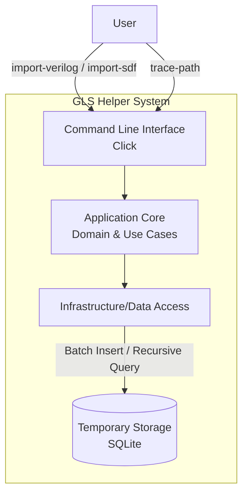
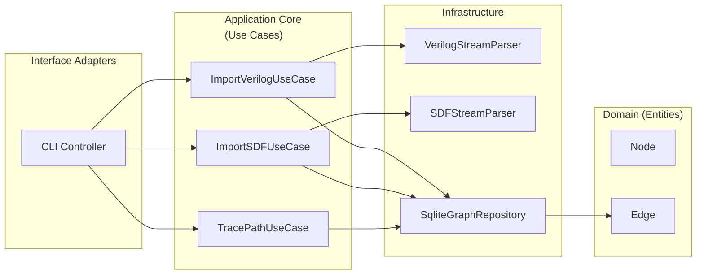
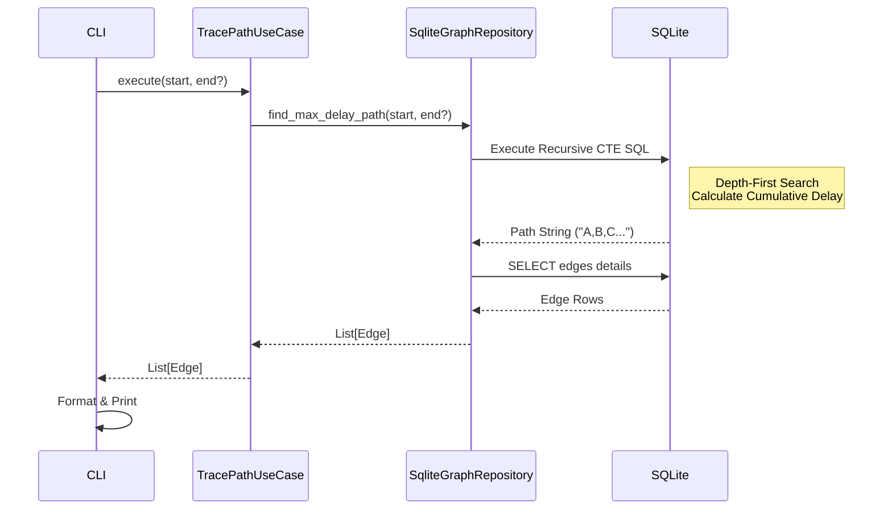

# c4-architecture.md

## 1. Introduction

本ドキュメントは、Python製「GLS Helper」のC4モデルアーキテクチャ記述です。
本システムは、大規模なGate Netlist（約1.2GB）とSDF（約10.6GB）を解析し、クリティカルパスの特定や累積遅延の計算を行うことを目的とします。

### Design Goals & Principles

* **Scalability**: メモリに収まらない巨大なデータセットを扱うため、ストリーミング処理とバッチ処理を前提とする。
* **Clean Architecture**: 外部リソース（ファイル、DB）とビジネスロジックを分離する。
* **SOLID & FP**: イミュータブルなデータ構造と純粋関数を指向し、副作用を局所化する。
* **Maintainability**: "Five Lines of Code" 原則に基づき、関数を極小化する。

## 2. Level 1: System Context Diagram

システム全体と外部アクターとの関係を示します。

## 3. Level 2: Container Diagram

システムの主要なコンテナ（アプリケーション、データストア）の責務分離を示します。

* **CLI**: `click` を使用したコマンドラインインターフェース。
* **Core**: ビジネスロジック。
* **Infra**: ファイル解析（Stream Parser）とDB操作（Repository）。
* **LocalDB**: SQLite。WALモードとインデックスを活用し、高速な書き込みと探索を実現。

## 4. Level 3: Component Diagram

### 4.1 Components Overview

### 4.2 Key Components Description

#### A. Stream Parsers (Infrastructure)

* **VerilogStreamParser**: 正規表現でモジュール接続を抽出し、バッチ処理でRepositoryへ渡す。
* **SDFStreamParser**: 括弧のネスティングを考慮したステートマシンで `(INTERCONNECT ...)` ブロックを抽出。SDFの階層名をDBのフラットな名前に正規化する。

#### B. Graph Repository (Interface: Domain / Impl: Infra)

**SqliteGraphRepository**:

* `update_edges_delay_batch`: SDFの遅延情報をBulk Updateする。
* **`find_max_delay_path`**: Python側での探索を行わず、**SQLiteの `WITH RECURSIVE` (CTE)** を使用してDBエンジン内で高速に最大遅延経路を探索する。

#### C. Use Cases

* **ImportVerilogUseCase**: ネットリストからグラフ構造（Node/Edge）を構築。
* **ImportSDFUseCase**: 構築済みのグラフに遅延情報を付与。
* **TracePathUseCase**: 指定された始点（および終点）に基づき、クリティカルパスを特定して返す。

## 5. Sequence: Trace Path Process

DBエンジン側の再帰クエリを活用したシーケンスです。

## 6. Implementation Guidelines (Constraints)

* **No Inheritance**: Protocolを活用し、継承による結合を回避。
* **Five Lines of Code**: メソッドは原則5行以内。複雑なロジックはプライベートメソッドへ委譲。
* **Immutability**: `frozen=True` な dataclass と `tuple` を使用。