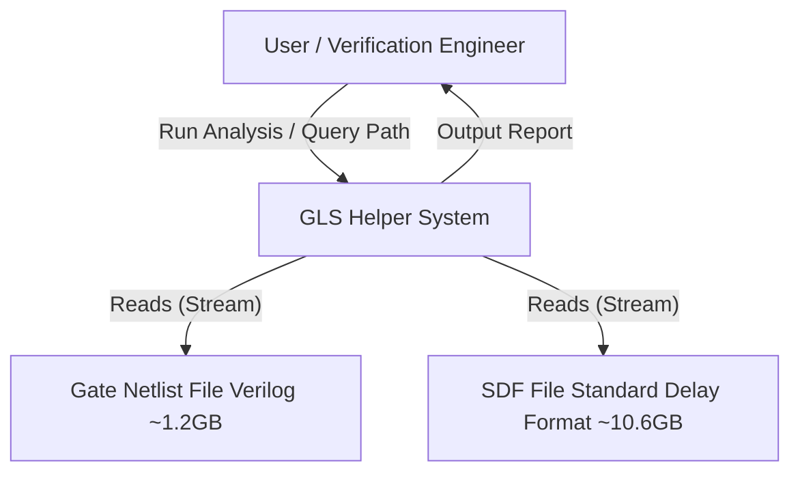
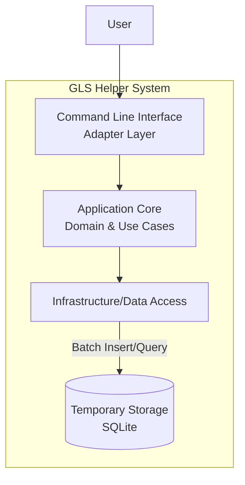
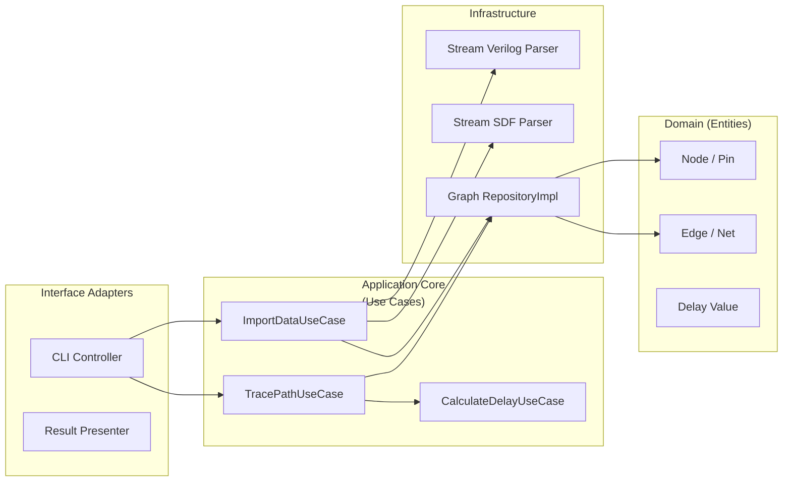
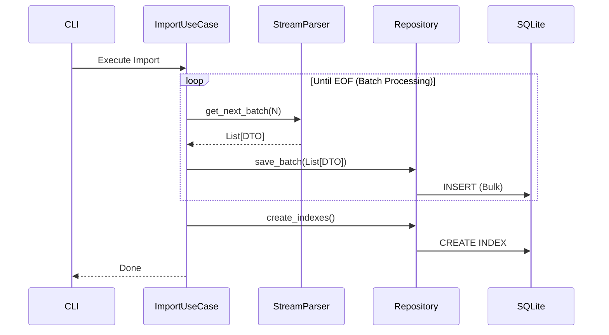

# c4-architecture.md

## 1. Introduction

本ドキュメントは、Python製「GLS Helper」のC4モデルアーキテクチャ記述です。
本システムは、大規模なGate Netlist（約1.2GB）とSDF（約10.6GB）を解析し、クリティカルパスの特定や累積遅延の計算を行うことを目的とします。

### Design Goals & Principles

* **Scalability**: メモリに収まらない巨大なデータセットを扱うため、ストリーミング処理とバッチ処理を前提とする。
* **Clean Architecture**: 外部リソース（ファイル、DB）とビジネスロジックを分離する。
* **SOLID & FP**: イミュータブルなデータ構造と純粋関数を指向し、副作用を局所化する。
* **Maintainability**: "Five Lines of Code" 原則に基づき、関数を極小化する。

## 2. Level 1: System Context Diagram

システム全体と外部アクターとの関係を示します。

## 3. Level 2: Container Diagram

システムの主要なコンテナ（アプリケーション、データストア）の責務分離を示します。

* **CLI**: ユーザー入力を受け取り、Use Caseを起動する。結果を表示用に整形する。
* **Core**: パス探索、遅延加算などのビジネスロジック。外部ライブラリやDBに依存しない。
* **Infra**: ファイルのパース（ストリーミング）、データの永続化、クエリの実装。
* **LocalDB**: メモリ圧迫を防ぐため、グラフ構造と遅延情報を一時的にディスクへ退避させるための軽量DB。

## 4. Level 3: Component Diagram

Clean Architectureに基づいた詳細なコンポーネント構成です。

### 4.1 Components Overview

### 4.2 Key Components Description

#### A. Stream Parsers (Infrastructure)

メモリ効率を最優先し、ファイルを一行ずつ、あるいはチャンクごとに読み込むジェネレータ（`yield`）として実装します。

* **VerilogStreamParser**:
* 正規表現を用い、モジュール宣言、インスタンス、ワイヤー接続を抽出。
* 巨大なファイルを一度に読み込まず、バッチサイズ（例: 10,000行）ごとにDTOを生成してUse Caseへ渡す。

* **SDFStreamParser**:
* `(CELL ...)` や `(IOPATH ...)` ブロックを検知。
* IOPATHごとの遅延値を抽出し、バッチ処理でリポジトリへ送る。

#### B. Graph Repository (Interface: Domain / Impl: Infra)

Clean Architectureの要。Coreは「データの保存先がSQLiteかメモリか」を知りません。

**GraphRepositoryProtocol (Interface)**:

* `save_nodes(nodes: List[Node])`
* `save_edges(edges: List[Edge])`
* `find_path(start: Node, end: Node) -> List[Edge]`
* `get_delay(edge: Edge) -> Delay`

**SqliteGraphRepository (Implementation)**:

* Python標準の `sqlite3` を使用。

**Batch Processing Strategy**:

* パースしたデータをPythonのリストに溜め、一定数（例: 100,000件）に達したら `executemany` で一括INSERTする。これによりI/Oオーバーヘッドを最小化する。
* インデックスを適切に貼り、パス検索（再帰クエリ CTE: Common Table Expressionsを使用可能）を高速化する。

#### C. Domain Logic (Functional Approach)

**PathFinder**:

* 純粋関数として実装。状態を持たない。
* 隣接リスト（またはRepositoryからのFetch結果）を受け取り、経路を返す。

**DelayCalculator**:

* `reduce` 関数等を用い、経路上のエッジ遅延を累積する。
* `(Path, List[Delay]) -> TotalDelay`

## 5. Sequence: Batch Import Process

巨大ファイルを処理するためのシーケンスです。

## 6. Implementation Guidelines (Constraints)

### Inheritance Policy (継承と型定義のポリシー)

**継承の完全禁止 (No Inheritance)**:

* 具象クラスはもちろん、`abc.ABC` を用いた抽象基底クラスからの継承も原則禁止とする。
* 目的: 実装詳細とインターフェース定義の物理的な結合を断ち切るため。

**プロトコルの採用 (Use Protocols)**:

* インターフェース定義には `typing.Protocol` を使用する（構造的サブタイピング）。
* 実装クラスはProtocolを継承せず、単にそのメソッドシグネチャを満たす形で実装する。
* これにより、Infrastructure層の実装クラスがDomain層の定義ファイルすらimportしなくて済む状態（究極の疎結合）を目指す。

### Five Lines of Code & clean Code

* **メソッド**: インデントを含むロジックは5行以内を目指す。
* **条件分岐**: `if/else` のネストを避け、早期リターンまたはポリモーフィズム、辞書ディスパッチを使用する。
* **変数**: 再代入を禁止（可能な限り`frozen=True` なdataclassを使用）。

### Dependency Rule

* 依存の方向は常に `Infra -> Adapter -> UseCase -> Domain`。
* `Domain` 層はいかなる外部ライブラリ（SQLAlchemyなど）にも依存しない。

### Memory Management Strategy

1. **Verilog読み込み**: Generatorを使い、インスタンス接続情報のみを抽出してDBへBulk Insert。
2. **SDF読み込み**: テキストストリームから `(IOPATH A Y (0.1::0.1))` のようなパターンのみを抽出し、該当するDBレコード（Edge）をUPDATE、またはDelayテーブルへInsert。
3. **解析**: Pythonオブジェクトとしてグラフ全体を構築せず、必要なパス周辺のみをSQLで取得してメモリに展開する。
